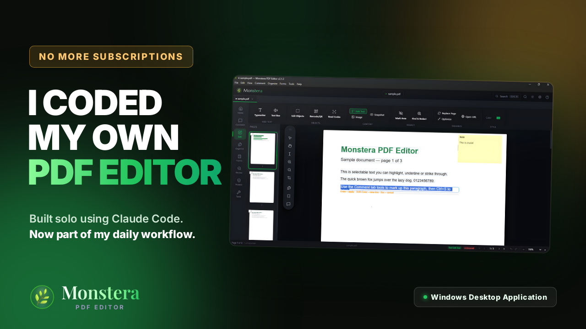
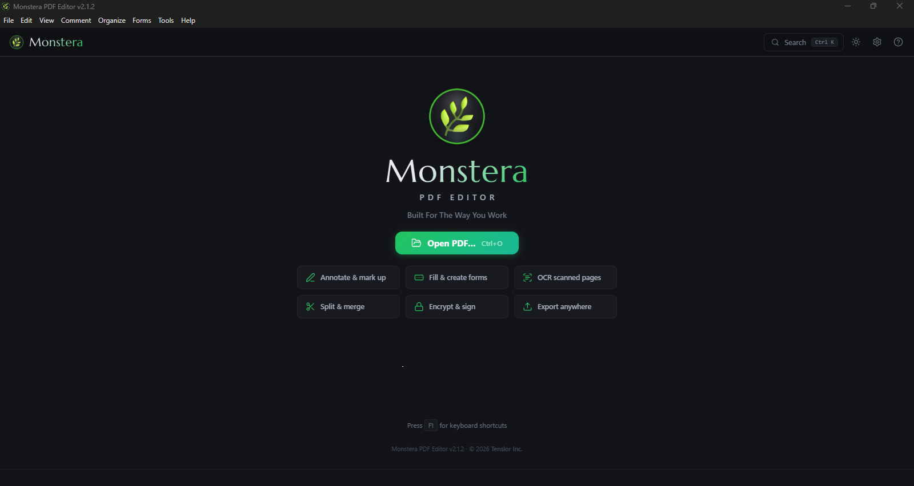
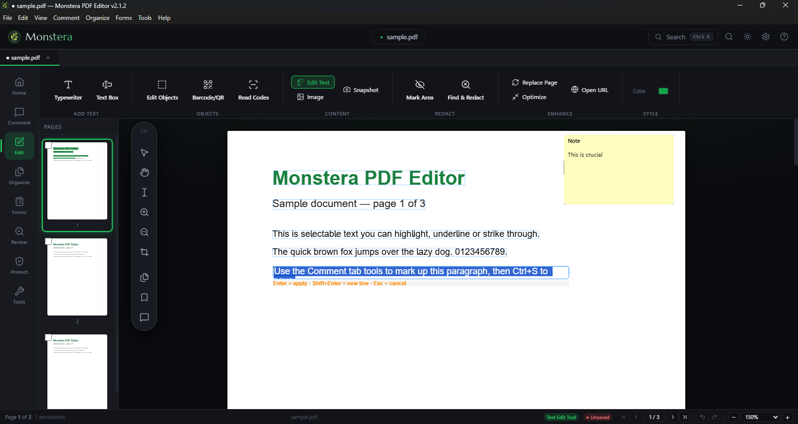

# Monstera PDF Editor

[](https://github.com/ememndon/monstera_pdf_editor/actions/workflows/ci.yml)

A feature-rich desktop PDF editor for Windows, built with Electron + React + TypeScript.
It aims for PDF-XChange-level capability: viewing, page management, annotations, forms,
OCR, redaction, digital signatures, in-place text editing, and export to Office formats.

> Personal-use project, shared publicly for code review. See `CLAUDE.md` for the full
> feature checklist and per-feature test steps. Licensed AGPL-3.0 (see `LICENSE`),
> inherited from its `mupdf` and `@cantoo/pdf-lib` dependencies.

## Demo

[](https://ememndon.com/videos/monstera.mp4)

*Click the thumbnail to play the demo video.*

## Screenshots

| Viewer & annotations | Forms & OCR |
|---|---|
|  |  |

## Features

- **Viewer:** continuous multi-page scroll, lazy rendering, zoom (fit-width/page,
  presets, Ctrl+scroll), thumbnail sidebar, full-text search with regex/case/whole-word
  options, recent-files list.
- **Page management:** delete, rotate, reorder (drag-and-drop), duplicate, insert
  blank/from-PDF/from-image, extract, merge, split, undo/redo.
- **Annotations:** highlight/underline/strikethrough, freehand ink, shapes, text boxes,
  sticky notes, stamps, typewriter, image insertion. All are saved as real PDF annotation
  objects that round-trip through save/reopen.
- **Forms:** fill AcroForm fields (text, checkbox, radio, dropdown, listbox, signature),
  create new fields, flatten to static content, export field data (JSON/XFDF).
- **OCR:** Tesseract.js for scanned pages, invisible searchable text layer, 13 languages.
  TrOCR (local, offline) and Azure Document Intelligence handle handwriting.
- **AI assistant:** ask questions about the open document in natural language, with
  one-click summarise, key points, and action items. Document text is extracted and passed
  as context (up to 80k characters). Requires your own Anthropic API key, stored locally.
- **AI vision reading:** transcribe a rendered page, handwriting included, into markdown
  prose or structured table JSON. Offered as one of five reading engines for Excel export.
- **Redaction:** true content removal via MuPDF (not just a cosmetic overlay), solid or
  blurred style.
- **Security:** AES-256 password protection, permission flags, PDF/A-2b export.
- **Signatures:** draw/upload/type visible signature stamps, plus PKCS#7/CMS digital
  signing with .pfx/.p12 certificates and signature verification.
- **In-place text editing:** line-level content-stream editing (not overlay-and-cover)
  that preserves font, colour, and kerning of untouched text on the same line.
- **Export:** PNG/JPEG/WebP, plain text, Word (.docx), PowerPoint (.pptx), and Excel
  (.xlsx) with table detection, OCR, and styled output (fonts, borders, merged headers)
  matching the source PDF.
- **Bookmarks, multi-tab documents, split view, crash recovery, autosave, dark/light
  theme**, and more. See `CLAUDE.md` for the full checklist.

## Architecture

Monstera runs as a standard Electron app, but the interesting part is that no single PDF
library does everything. Four engines are combined, each used for what it's best at:

```
renderer (React, browser context)
  │  window.electronAPI.*  (contextBridge, no direct Node access)
  ▼
preload (contextBridge surface)
  │  ipcRenderer.invoke(...)
  ▼
main process (Node.js)
  ├─ pdf.js        : page rendering to canvas, text layer, search
  ├─ pdf-lib        : annotation/form objects, page ops, metadata (JS, portable)
  ├─ mupdf (WASM)   : redaction, outline, appearance streams, print rasterization
  │                   (fitz coordinate space is y-down, so it is flipped at every
  │                   boundary that crosses into or out of PDF space)
  └─ PDFium (koffi FFI) : line-level in-place text editing directly against the
                           content stream. Diffs old/new line text and rewrites only
                           the changed run so untouched runs keep their exact font
                           bytes
```

Why split across engines instead of picking one: `pdf.js` has no write path, `pdf-lib`
has no rasterizer, and neither can do true (non-cosmetic) redaction or content-stream-level
text editing. MuPDF and PDFium fill those gaps respectively. The main process owns all of
them; the renderer never touches PDF bytes directly, only IPC calls.

Electron security baseline: `contextIsolation: true`, `nodeIntegration: false`, in-app
navigation blocked, external links forced to the OS browser, saves are atomic
(temp-file + rename with retry).

## Tech stack

| Layer | Library | Responsibility |
|---|---|---|
| Desktop shell | Electron 42 | Window management, native OS integration, packaging |
| UI | React 18 + Vite 6 + TypeScript | All renderer UI and state (zustand stores) |
| PDF rendering | pdfjs-dist (PDF.js) v6 | Canvas render, text layer, search |
| PDF editing | pdf-lib (aliased to `@cantoo/pdf-lib`) | Page ops, annotations, forms, metadata |
| Heavy PDF ops | mupdf (WASM) v1.27 | Redaction, outline, appearance streams, print |
| In-place text edit | PDFium via koffi FFI (main process) | Line-level content-stream text editing |
| OCR | tesseract.js v7 / TrOCR / Azure | Scanned-page OCR and handwriting |
| AI | @anthropic-ai/sdk (main process) | Document Q&A, summarisation, vision transcription |
| Packaging | electron-builder | NSIS installer + portable .exe |

## Project layout

```
src/
  main/        Electron main process (Node): app lifecycle, IPC handlers, native engines
  preload/     contextBridge, the only surface the renderer can call (window.electronAPI)
  renderer/    React app (browser context, no direct Node access)
    components/ UI components and dialogs
    hooks/      Custom hooks (keyboard, page operations)
    store/      zustand stores (usePdfStore, useTabsStore, useSettingsStore, useToastStore)
    utils/      Pure helpers (annotation geometry, tab snapshots, logger, …)
scripts/       Build script + `prove-*.mjs` verification harnesses
```

## Commands

```bash
npm run dev        # Live-reload dev (Vite + Electron)
npm run typecheck  # Strict tsc over renderer AND main/preload (no emit)
npm run lint       # ESLint (flat config; lenient baseline, 0 errors expected)
npm run check      # typecheck + lint, run before committing
npm run build      # typecheck → Vite build → tsc(main) → electron-builder (installer + portable)
```

Build output (after `npm run build`):

- Installer: `release/Monstera PDF Editor Setup <version>.exe`
- Portable:  `release/Monstera PDF Editor <version>.exe`
- Unpacked:  `release/win-unpacked/Monstera PDF Editor.exe`

## Verification harnesses

The `scripts/prove-*.mjs` files exercise the trickiest engines end-to-end and assert on
the result (they are the project's tests). Notable ones:

- `prove-sig-verify.mjs`: signs a PDF, verifies it (valid), tampers one byte, re-verifies (detected).
- `prove-line-edit.mjs`: line-level Edit Text preserves fonts/colours/spacing, and subset fonts stay in-place.
- `prove-pdfa.mjs`, `prove-styled-excel.mjs`, `prove-trocr-excel.mjs`, and others cover export fidelity.

Run any with `node scripts/<name>.mjs` (needs `npm run build:electron` first for the ones
that import the compiled engine).

## Security posture

- `contextIsolation: true`, `nodeIntegration: false`; the renderer only reaches the main
  process through the `preload` contextBridge.
- In-app navigation is blocked; external links open in the OS browser.
- Permission requests are denied except camera/mic (for the Webcam Capture tool).
- Saves are atomic (temp-file + rename, with retry on Windows AV/lock) and refuse to
  overwrite a target with non-PDF bytes.
- API keys (Anthropic, Azure) are stored locally in app settings, never committed, and
  excluded from settings export.

## Crash recovery

While a document is dirty, Monstera writes a self-contained recovery copy to `userData/recovery`.
A clean save/close clears it; anything left after an unexpected exit is offered back on next launch.
